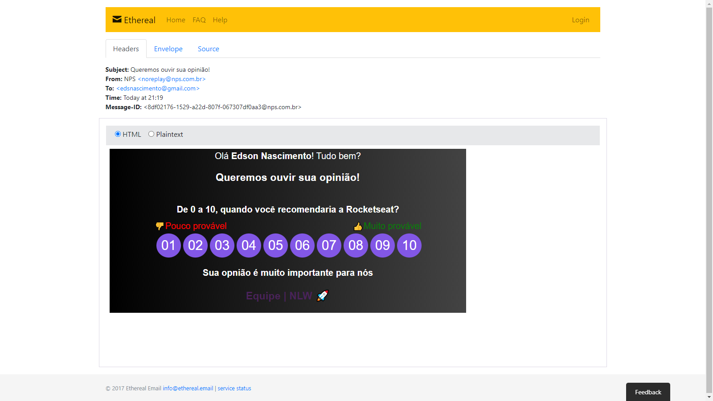

<h1 align="center">
    NPS API
</h1>


<p align="center">
  <a href="#-tecnology">Tecnology</a>&nbsp;&nbsp;&nbsp;|&nbsp;&nbsp;&nbsp;
  <a href="#-project">Project</a>&nbsp;&nbsp;&nbsp;|&nbsp;&nbsp;&nbsp;
  <a href="#-license">License</a>
</p>

<p align="center">
 

  
</p>

<br>

## 💻 Project

##### Projeto Realizado durante o evento do nlw 4 

<p>O projeto consiste em um API, no qual será calculado o NPS(Net Promoter Score)</P>

### O Cálculo NPS

<p>
Calcule seu NPS usando a resposta a uma pergunta-chave, usando uma escala de 0 a 10: Qual a probabilidade de você recomendar [marca] a um amigo ou colega?

Os entrevistados são agrupados da seguinte forma:

    Os promotores (pontuação 9 a 10) são entusiastas leais que continuarão comprando e recomendando outros, estimulando o crescimento.
    Passivos (pontuação 7 a 8) são clientes satisfeitos, mas pouco entusiasmados, vulneráveis ​​a ofertas competitivas.
    Detratores (pontuação 0-6) são clientes insatisfeitos que podem prejudicar sua marca e impedir o crescimento por meio do boca a boca negativo.

Subtrair a porcentagem de Detratores da porcentagem de Promotores resulta no Net Promoter Score, que pode variar de um mínimo de -100 (se cada cliente for um Detrator) a um máximo de 100 (se cada cliente for um Promotor).

</p>

# Preview 🛰

<p align="center">
  
</p>
<p align="center">
  
</p>

## 🚀 Technology

This project was developed with the following technologies:

<b>Backend</b>
- [Node JS]()
- [MySQL]()
- [Express]()
- [TypeORM]()

<b>Frontend (only used to send the survey in the email)</b>
- [HTML]()
- [CSS]()

## 🛠 Install

1. Clone o repositório:

   ```bash
   $ git clone https://github.com/edsnasc/API_NPS.git
   ```
2. configure o banco de dados de sua preferencia no arquivo
    
    ```bash
   entre na documentação para configurar o banco https://typeorm.io/#/
   ```

3. instale o typeORM execute o comandos para criar as tabelas no banco

    ```bash
   $ typeorm migration:run
   ```
4. execute o comando 

    ```bash
   $ yarn dev
   ```

## 📝 License

This project is under the MIT license. See the [LICENSE] file (LICENSE.md) for more details.

---

Created by Edson Nascimento 🚀/ [LinkedIn](https://www.linkedin.com/in/edson-nascimento-5783681aa/)
